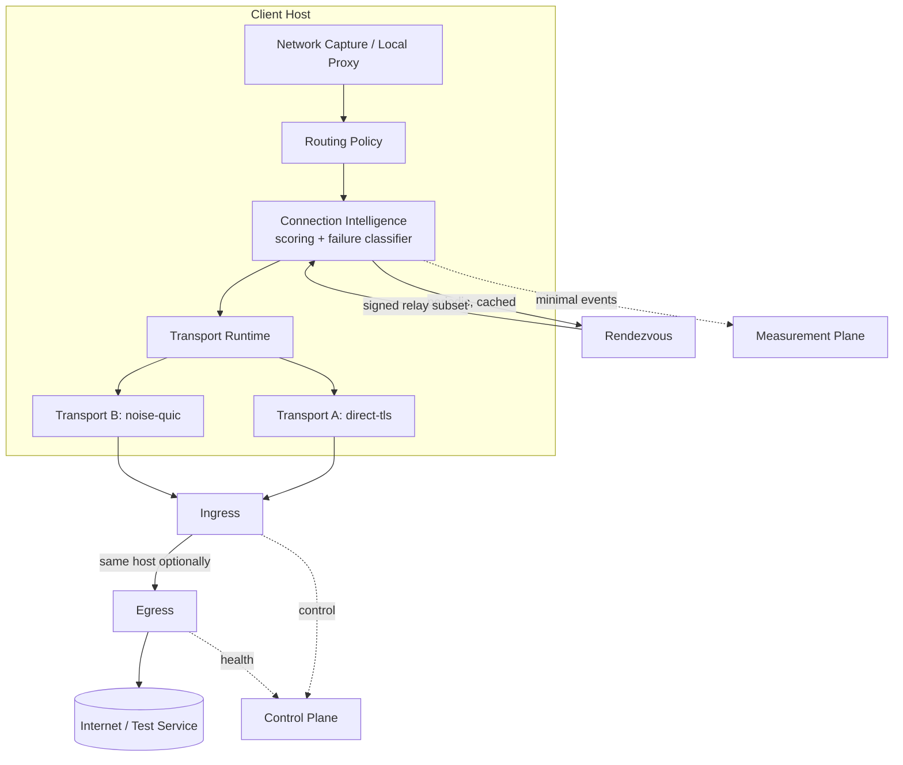

# ARCHITECTURE.md

## Core principle

> The protocol is not the product. The adaptive connection system is the product.

No transport, endpoint, or relay is assumed to remain reachable forever. The
client core is durable; transports, endpoints, and relays are replaceable,
independently-failing infrastructure selected by an adaptive engine driven
by observed, classified failures.

## System diagram



## Layering (client)

```
Local listener (loopback proxy / future TUN)
        │
Routing policy (what must go through the tunnel)
        │
Connection intelligence (endpoint + transport scoring, failure classification)
        │
Transport runtime (capability negotiation, lifecycle)
        │
Selected transport (direct-tls | noise-quic | ...)
```

Each layer only depends on the interfaces below it (`transport-api`,
`network-state`, `policy`), never on concrete transport implementations.
`apps/client-daemon` is the only crate allowed to depend on concrete
transports (`transport-native`) and wire them into the engine.

## Workspace layout

```
crates/
  common              shared ids, errors, time buckets
  crypto              signing/verification primitives (no custom crypto)
  config              signed bundle schema + verification
  transport-api       Transport trait + capability model (no implementations)
  network-state       failure category taxonomy, observations
  failure-classifier  connection state machine
  policy              endpoint/transport confidence scoring, quarantine, fallback
  transport-native    direct-tls (rustls) + noise-quic (quinn) implementations
  rendezvous-client   fetch/verify/cache signed relay bundles
  telemetry           minimal privacy-preserving event schema
apps/
  client-daemon       wires engine + transports + local proxy together
  cli                 diagnostic CLI talking to the daemon over a control socket
services/
  rendezvous          issues signed, expiring, partial relay subsets
  relay-agent         ingress and/or egress forwarding
tests/
  integration tests, hostile-network (tc netem) tests
fuzz/
  cargo-fuzz targets for config + rendezvous parsing
```

## Compatibility stack (Hiddify / VLESS+REALITY / Hysteria2)

A second, parallel client-compatibility stack exists beside the native
one above — see `docs/COMPATIBILITY_IMPLEMENTATION_PLAN.md` for the
full design. Summary:

```
crates/
  compat-config       CompatUser/CompatEndpoint types, credential
                       generation, URI/sing-box JSON rendering,
                       CompatibilityBackend trait — separate from
                       config/transport-api, never signed into a
                       RelayBundle (spec §5)
apps/
  admin               vpn-admin: user lifecycle CLI, sing-box config
                       render/validate/apply
services/
  subscription        loopback-only HTTP service, GET /sub/{token}
deploy/
  almalinux/          production installer (separate from deploy/local/)
```

External, unmodified `sing-box` is the data plane (not vendored, not
reimplemented — see `docs/COMPATIBILITY_VERSIONS.md`). Nothing in
`transport-api`, `policy`, `failure-classifier`, `transport-native`,
`config`, or `rendezvous-client` was changed to support this — the two
stacks share a Cargo workspace and nothing else at the type level.

## Bootstrap vs steady-state path

`transport-api::Transport` separates `connect()` (bootstrap: handshake,
auth) from the resulting `Session` (steady-state: read/write, optional
`migrate()` if the transport declares the `migration` capability). No
transport in this slice implements migration yet; the trait is shaped so a
future QUIC-connection-migration-style transport can add it without an API
break — see `crates/transport-api/src/lib.rs`.

## Relay topology

`relay-agent` can run as `combined` (ingress+egress in one process/hop) or
`ingress`/`egress` split across two hops, selected by config, not hardcoded
— see `docs/DEPLOYMENT.md` and ADR-0006.

## What this repository actually implements vs. documents-only

See `PLAN.md` and `TASKS.md` for the authoritative, current split. In
summary: config signing, capability model, failure classification, scoring,
two independent transports, split-capable relay, signed rendezvous, CLI,
and hostile-network tests are real and tested. WASM transport sandboxing,
OS kill-switch firewall integration, mobile/desktop platforms, a
third external-transport adapter, and the full measurement aggregation
service are deferred and documented, not stubbed.
